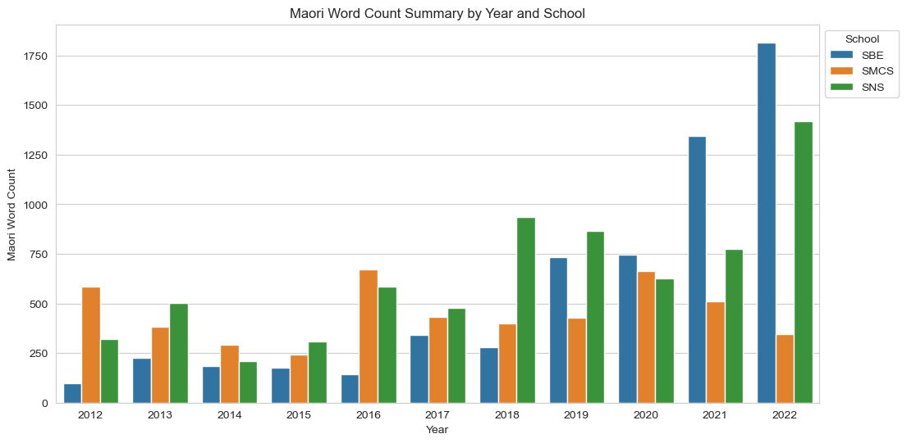
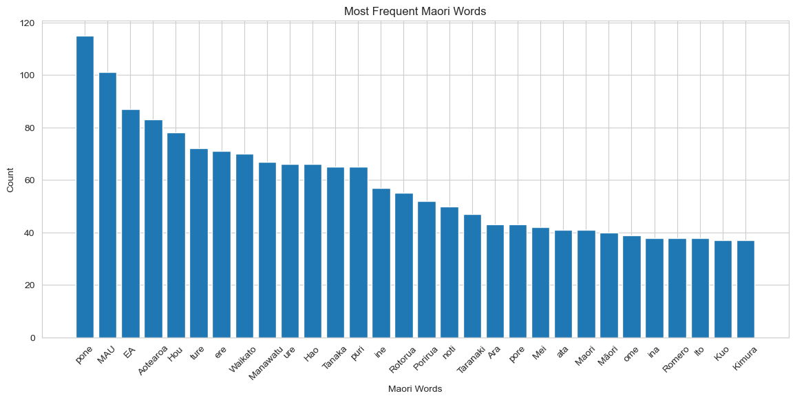

## README for Te Reo Māori Usage Analysis in College of Sciences

This repository provides an analysis of the usage of Te Reo Māori across different units within the College of Sciences at Massey University. The research was funded by the College of Sciences' REaDI Iwi Fund and conducted by Teo Susnjak from the School of Mathematical and Computational Sciences (SMCS). The analysis aims to support the attainment of Mātauranga Māori aspirations within the College by examining the frequency and patterns of Te Reo Māori words in academic publications.

### Project Overview

The primary objective of this research is to understand the current state of Te Reo Māori usage within the College of Sciences and to provide data-driven insights for decision-making regarding Mātauranga Māori goals. The project involved the following key activities:

- **Data Collection**: Gathering publications from academics within the College of Sciences.
- **Natural Language Processing (NLP)**: Applying NLP techniques to pre-process, analyse, and extract meaningful patterns from the collected data.
- **Preliminary Analysis**: Generating initial statistics and visualisations to present proof-of-concept findings.

### Preliminary Findings

Two key visualisations shown here have been created from the initial dataset, which consists of approx 1500 research papers from 300 academics based at three schools within the College of Sciences: the School of Mathematical and Computational Sciences (SMCS), the School of Natural and Computational Sciences (SNS) and the School of Built Environment (SBE). These preliminary results highlight the trends in Te Reo Māori word usage across different units.

#### Figure 1: Māori Word Count Summary by Year and School

This bar chart summarises the count of Māori words used in publications from 2012 to 2022. It compares the usage across three schools: SBE (School of  Built Environment ), SMCS (School of Mathematical and Computational Sciences), and SNS (School of Natural and Computational Sciences). The trends indicate varying levels of engagement with Te Reo Māori over the years, with a noticeable increase in recent years, especially in the SMCS and SNS.

#### Figure 2: Most Frequent Māori Words

This bar chart shows the most frequently used Māori words in the analysed publications. The words are listed along the x-axis, while their respective counts are displayed on the y-axis. The data reveals the prominence of specific Māori terms within the academic discourse of the College of Sciences, providing insights into commonly discussed concepts and themes.

### Future Work

The preliminary results serve as a foundation for more comprehensive analysis. The next steps include:

- **Expanding Data Collection**: Gathering publications from all academics within the College of Sciences to create a complete dataset.
- **Refining Methodology**: Enhancing the NLP techniques and Māori dictionaries to improve the accuracy and depth of the analysis.
- **Collaborating with Experts**: Working with other experts to develop informed strategies for studying Te Reo Māori usage over time.

### Contact Information

For further information or to contribute to this project, please contact:

- **Principal Investigator**: Teo Susnjak
- **Co-Investigators**: Vajisha Wanniarachchi and Anuradha Mathrani
- **School**: School of Mathematical and Computational Sciences
- **Email**: t.susnjak@massey.ac.nz

### Acknowledgements

This research was made possible by the College of Sciences' REaDI Iwi Fund.  We extend our gratitude to the funding body and collaborators for their support.

