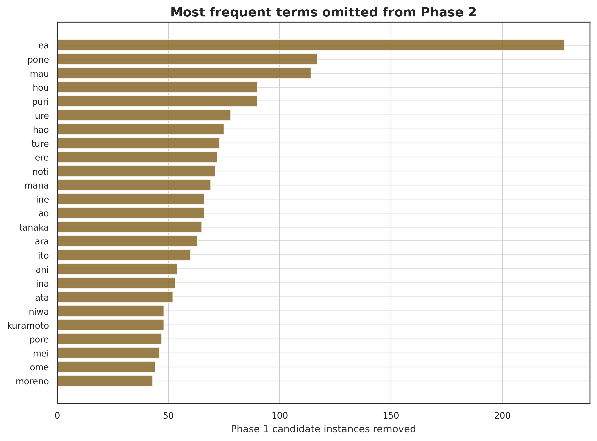
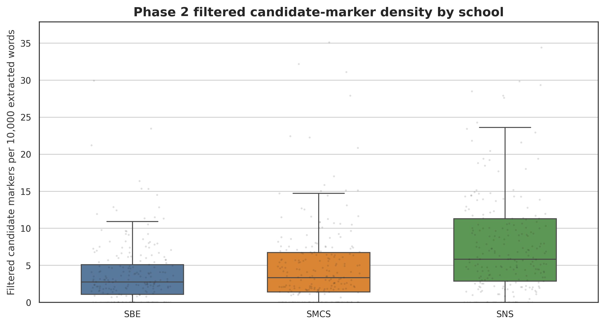
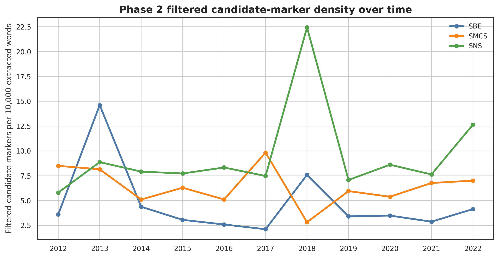
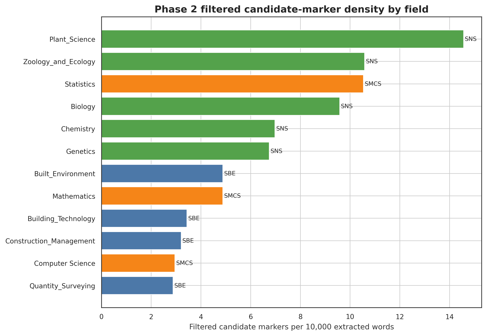
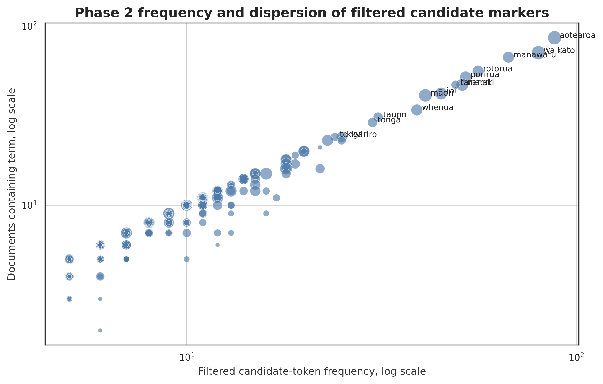
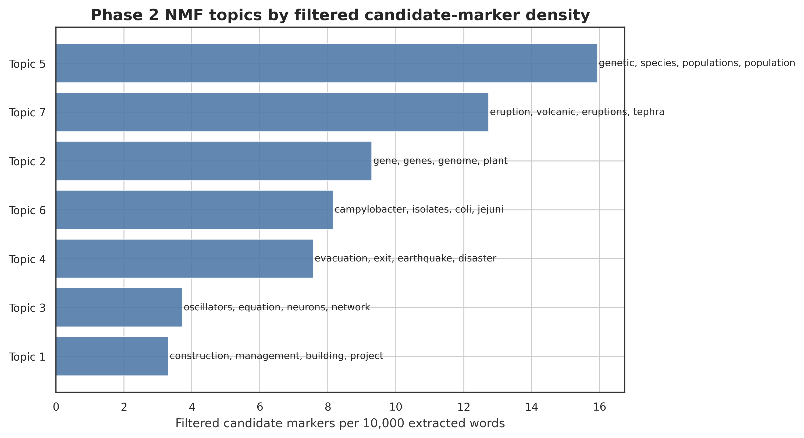

# A small-scale computational audit of Te Reo Māori visibility in College of Sciences publications, 2012-2022

**Draft GitHub preprint**

Teo Susnjak, Vajisha Wanniarachchi, and Anuradha Mathrani  
Massey University, Aotearoa New Zealand

## Abstract

This working paper presents a small-scale computational audit of visible Te Reo Māori usage in research publications associated with Massey University's College of Sciences. The study was developed through the College of Sciences REaDI Iwi Fund as an exploratory method for describing how Māori-language terms appear in published research outputs over time. A corpus of 1,393 publication records from 2012 to 2022 was assembled by following a selected panel of academics across three College schools: the School of Built Environment (SBE), the School of Mathematical and Computational Sciences (SMCS), and the School of Natural Sciences (SNS). Publication PDFs were organised by school, field, and year, text was extracted from the PDFs, and a rule-based natural language processing workflow was used to identify candidate Te Reo Māori words and terms. The analysis is reported in two phases. Phase 1 preserves the original broad candidate-detection workflow, which produced 16,805 candidate term instances across 4,517 unique candidate tokens in the cleaned working dataset. Phase 2 reanalyses the matched corpus after excluding documented false positives such as OCR fragments, English or technical collisions, author names, acronyms, DOI fragments, and dual-use terms that were not functioning as Māori-language usage in sampled contexts. In the matched 1,391-record reanalysis, Phase 2 retained 10,291 of 16,769 broad candidate instances. Results indicate variation across schools and fields, while also showing that some apparent patterns in the original extraction were inflated by imperfect text extraction and dictionary-based matching. The contribution of this paper is therefore methodological and descriptive: it shows that a lightweight text-mining workflow can provide a preliminary view of Māori-language visibility in scientific publishing, and that a transparent validation layer is necessary before stronger claims can be made.

**Keywords:** Te Reo Māori; Mātauranga Māori; research publications; natural language processing; language visibility; institutional research analytics; Aotearoa New Zealand

## 1. Introduction

Universities in Aotearoa New Zealand increasingly seek to understand how their research activities relate to Te Reo Māori, Mātauranga Māori, and institutional commitments to research that is meaningful in this national context. One practical challenge is measurement. Institutional reporting often captures outputs, funding, collaborations, and citations, but it less often captures the visible presence of Māori language within the published record itself.

This study addresses that practical measurement problem at a modest scale. It asks whether a computational text-mining workflow can provide a first-pass description of Te Reo Māori visibility across a selected panel of College of Sciences publication outputs at Massey University. The intent is not to judge individual publications or researchers, nor to infer the quality of engagement with Māori knowledge. Rather, the aim is to test whether a reproducible corpus and a transparent text-processing pipeline can generate useful descriptive evidence about the appearance of Māori-language terms across schools, fields, and years.

The project was conducted as an exploratory REaDI Iwi Fund activity at Massey University's College of Sciences. The original practical goal was to collect publications from selected researchers across the College, follow their outputs over approximately a decade, extract text from publication PDFs, identify candidate Māori-language terms, and visualise patterns over time. This panel-style design was intended to improve longitudinal comparability by avoiding a constantly changing researcher sample. The present GitHub preprint brings those outputs together into a single narrative: the motivation, literature context, research questions, methods, descriptive results, limitations, and future work.

The paper is deliberately cautious in its claims. The original workflow identifies candidate Māori-language tokens using rule-based text processing and filtering. Some detected tokens are genuine Māori terms, including place names and culturally meaningful concepts; others are false positives caused by names, acronyms, PDF extraction artefacts, short words, or non-Māori strings that resemble Māori phonotactic patterns. A second-stage filtered analysis was therefore added to document and remove the clearest high-risk terms before recalculating the main descriptive results. For this reason, the findings should be read as a preliminary audit of candidate language visibility, with Phase 1 representing a broad upper-bound estimate and Phase 2 representing a more conservative filtered estimate.

## 2. Literature review

### 2.1 Mātauranga Māori and research in Aotearoa New Zealand

Mātauranga Māori is commonly described as a broad knowledge system that includes Māori ways of knowing, knowledge generation, values, relationships, and locally grounded understandings. Mercier (2018) emphasises that Mātauranga Māori is not simply a static archive of traditional information. It is a continuing knowledge-generating system that is connected to iwi, hapū, place, practice, and contemporary research. This distinction is important for the present study because counting Te Reo Māori terms in publications cannot, by itself, measure Mātauranga Māori. A term count can only provide one narrow indicator of visibility within written research outputs.

Broughton and McBreen (2015) similarly describe Mātauranga Māori as a complete knowledge system, with its own principles and forms of organisation. For this study, that account shapes the interpretation of results: the computational method can identify textual traces, but it cannot evaluate whether the research itself is substantively grounded in Māori knowledge systems, partnership, or local priorities. Kaiser and Saunders (2021) provide a more applied research-planning perspective. They examine Vision Mātauranga as a research policy context and argue that researchers often need clearer starting points for understanding Māori interests, priorities, and engagement pathways. Their focus on iwi and hapū management plans is useful because it highlights a practical gap between broad research-policy expectations and the everyday planning work of researchers. The current study sits in a related practical space: it does not solve the deeper question of research engagement, but it offers a descriptive tool that institutions can use to notice broad publication-level patterns.

### 2.2 Te Reo Māori visibility and language planning

The visibility of Te Reo Māori in public and institutional domains matters because language use is shaped not only by fluent speakers but also by wider social settings, norms, and attitudes. De Bres (2011) examines government efforts to promote positive attitudes and behaviours toward Te Reo Māori among non-Māori New Zealanders. Her analysis is relevant here because academic publishing is one of the institutional domains in which attitudes toward language visibility can become visible. Even when publications are written primarily in English, the presence or absence of Māori words, place names, and concepts can indicate how a research community represents its national and cultural context. Barr and Seals (2018) show that language policy is not only a matter of high-level institutional statements. In their study of mainstream New Zealand schools, teachers' identities, attitudes, capabilities, and micro-policies affected the presence of Te Reo Māori in classroom practice. While their setting is education rather than research publishing, the same general insight applies: language visibility depends on local practices and norms as much as formal commitments. In research publications, language choices may similarly reflect disciplinary conventions, author familiarity, journal expectations, and the relevance of Māori terms to the research topic. Boshier (2015) reviews Māori language revitalisation across informal, non-formal, and formal learning settings. His account is useful for situating the study historically: Te Reo Māori visibility in contemporary institutions can be read against a longer trajectory of language decline, revitalisation, policy activity, and expanding interest in language learning. This study does not evaluate language revitalisation outcomes, but it uses computational methods to observe one small domain in which language visibility can be tracked over time.

### 2.3 Multilingual academic publishing

Academic publishing is strongly shaped by English-language norms. Curry and Lillis (2024) argue that academic knowledge production is often treated as an "English Only" space, despite the multilingual realities of many research communities. Their work provides a useful international frame for this study. The question for the present paper is not whether English should disappear from scientific publishing. It is more limited: whether a local publication corpus can be examined for visible Māori-language markers in a transparent and reproducible way.

### 2.4 Gap addressed by this study

The reviewed literature supports three starting assumptions. First, Mātauranga Māori is a broad knowledge system and cannot be fully represented by term counts. Second, Te Reo Māori visibility across institutional domains is a reasonable descriptive topic because language presence is one observable part of a wider research culture. Third, academic publishing is a multilingual and locally situated activity, even when English is the dominant language of publication.

The gap addressed here is practical and methodological. We ask whether a small, transparent NLP workflow can be used to produce a descriptive baseline of candidate Te Reo Māori terms in a defined institutional publication corpus. Such a baseline cannot answer every substantive question, but it can support more informed discussion and identify where richer qualitative or validated linguistic analysis would be needed.

## 3. Research questions

The present analysis is guided by three research questions:

**RQ1.** What is the distribution of candidate Te Reo Māori terms in a selected panel of College of Sciences publication outputs from 2012 to 2022?

**RQ2.** How do candidate term counts vary across schools, fields, and years?

**RQ3.** How do the descriptive results change when broad candidate detection is followed by a conservative second-stage filtering process?

**RQ4.** What methodological issues arise when using automated text extraction and rule-based filtering to estimate Māori-language visibility in research publications?

These questions are intentionally descriptive. They align with the current dataset and do not require new experiments beyond the existing corpus and processing outputs.

## 4. Methodology

### 4.1 Corpus and publication scope

The working corpus consists of publication PDFs and metadata associated with a selected panel of academics in Massey University's College of Sciences from 2012 to 2022. The processed dataset used for the present draft is `Processed_Data_Cleaned_Removed.csv`, which contains 1,393 publication records.

The sampling logic is longitudinal rather than census-based. The project followed selected academics across the study period to reduce the risk that year-to-year changes were driven only by changes in who was included in the corpus. This design improves comparability across time, but it also means that the corpus should be interpreted as a panel-based sample rather than a complete institutional record of College publication activity.

The publications are grouped into three schools:

- School of Built Environment (SBE): 423 records
- School of Mathematical and Computational Sciences (SMCS): 471 records
- School of Natural Sciences (SNS): 499 records

The corpus also includes field-level labels. SBE records are distributed across Building Technology, Built Environment, Construction Management, and Quantity Surveying. SMCS records are distributed across Computer Science, Mathematics, and Statistics. SNS records are distributed across Biology, Chemistry, Genetics, Plant Science, and Zoology and Ecology.

The broader source export, `Publications_in_College_of_Sciences_2012_to_2022.xlsx`, contains a larger bibliographic dataset. The present analysis uses the subset for which PDFs were processed and cleaned in the project workflow.

### 4.2 Text extraction

Publication PDFs were organised by school, field, and year in the `datasets/CoS-Merged/` directory. PDF text was extracted using Python, primarily through `PyPDF2`, and then tokenised using regular-expression based word extraction. The extraction process attempted to remove common PDF artefacts such as hyphenation across line breaks.

PDF extraction quality is a known limitation. Some PDFs contain encoding artefacts, split words, tables, headers, footers, reference lists, and publisher metadata. These features can affect both the total extracted text and the candidate Māori-term list.

### 4.3 Candidate Māori-term detection

The candidate Māori-term detection was implemented through a local, rule-based Python workflow rather than through a fully validated external Māori NLP package. The workflow tokenised text using regular expressions, defined Māori vowel and consonant character sets, handled macrons, converted `ng` and `wh` into internal single-character forms for orthographic checking, and compared tokens against hand-coded lists of non-Māori and ambiguous words. The workflow also included helper logic for checking candidate words against online dictionary resources, although the batch extraction primarily relied on the local rule-based classification.

This detector is best understood as a deterministic heuristic rather than a trained language model. Its strength is transparency: the rules are inspectable, the non-Māori and ambiguous-word lists can be updated, and the method can be run reproducibly across a large PDF corpus. Its weakness is that orthographic plausibility is not the same as linguistic validity. Māori has a relatively compact alphabet, regular syllable patterns, frequent vowel sequences, and many short words; these same features make it possible for English fragments, OCR errors, author names, technical acronyms, DOI strings, and words from other languages to resemble Māori-like tokens. The detector also operates mainly at token level, so it does not know whether a candidate occurs in the body of an article, a reference list, an affiliation, a table, or a broken word produced by PDF extraction.

Online searching suggests that related `kupu_māori`/Māori-word-detection code has been used in small public analytical workflows, such as mapping Māori words in New Zealand road names, but it does not appear to be a widely benchmarked Māori-language identification model. For this reason, the present study treats its output as candidate detection rather than validated language identification.

In practical terms, the process included:

1. extracting words from each PDF;
2. normalising or processing text for matching;
3. passing tokens through the local rule-based Māori-candidate classifier;
4. removing known false positives and stop words through a later cleaning pass;
5. saving publication-level candidate term lists in CSV form.

The final compact dataset used here stores candidate terms in a `Maori_words` column. For each publication, candidate terms were split on commas and counted as candidate term instances.

### 4.4 Two-phase analysis design

The paper reports the analysis in two phases.

**Phase 1: broad candidate detection.** Phase 1 preserves the original project workflow. It reports the cleaned candidate-token counts generated from the `PyPDF2`, regex-tokenisation, and local rule-based Māori-candidate detection pipeline. This phase is important because it reflects the results that were available from the original analysis and provides a transparent upper-bound estimate of possible Māori-language markers in the corpus.

**Phase 2: conservative filtered reanalysis.** Phase 2 was added after context checks showed that some high-frequency candidate tokens were not functioning as Māori-language usage. Examples included OCR and tokenisation fragments such as `ea`, `ure`, `ture`, `ine`, and `noti`; DOI or publisher fragments such as `pone`; technical or English terms such as `automata`, `minima`, `iterate`, and `nanopore`; author or method names such as `Tanaka`, `Ito`, `Kuramoto`, `Runge`, and `Akaike`; and dual-use or ambiguous terms such as `mana`, which appeared frequently as part of English words such as `management`. Phase 2 therefore applies a documented exclusion list and recalculates density, dispersion, keyness, and topic-level summaries using the retained candidate markers.

The Phase 2 filtering process should not be read as a complete manual validation of every retained term. Rather, it removes the most evident high-frequency error categories and provides a more conservative lower-bound view of the dataset. This distinction is important because language-detection libraries and rule-based orthographic filters are imperfect, especially when applied to OCR/PDF-derived scientific text.

### 4.5 Descriptive analysis

The analysis in this paper is descriptive. We counted:

- number of publication records by school, field, and year;
- number of records containing at least one candidate term;
- total Phase 1 candidate term instances by school, field, and year;
- Phase 2 filtered candidate term instances after excluding documented false positives;
- normalised Phase 2 density per 10,000 extracted words;
- term dispersion across documents, fields, schools, and years;
- topic-level Phase 2 density using exploratory NMF topic assignments.

No inferential statistical tests are reported in this draft. Given the exploratory nature of the corpus and the known false-positive problem, inferential claims would be premature.

## 5. Results

The results are presented in two parts. Phase 1 reports the original broad candidate-detection results. Phase 2 then reports the filtered reanalysis after removing documented high-risk false positives.

### 5.1 Corpus composition

The cleaned working dataset contains 1,393 publication records across 2012-2022. Table 1 summarises the distribution by school.

**Table 1. Publication records by school**

| School | Publication records |
|---|---:|
| SBE | 423 |
| SMCS | 471 |
| SNS | 499 |
| **Total** | **1,393** |

The number of publication records increases in the later years of the corpus, with 188 records in 2022 compared with 97 in 2012. This reflects the composition of the assembled researcher-panel corpus and should not automatically be interpreted as a change in College publication productivity or in the publication behaviour of the wider College.

**Table 2. Publication records by year**

| Year | Publication records |
|---:|---:|
| 2012 | 97 |
| 2013 | 103 |
| 2014 | 94 |
| 2015 | 93 |
| 2016 | 133 |
| 2017 | 110 |
| 2018 | 116 |
| 2019 | 151 |
| 2020 | 154 |
| 2021 | 154 |
| 2022 | 188 |

### 5.2 Phase 1: broad candidate term counts by school

The cleaned dataset contains 16,805 candidate term instances. Table 3 summarises the school-level distribution.

**Table 3. Candidate Te Reo Māori term instances by school**

| School | Records | Records with candidate terms | Candidate instances | Mean candidate instances per record |
|---|---:|---:|---:|---:|
| SBE | 423 | 394 | 5,460 | 12.91 |
| SMCS | 471 | 430 | 4,651 | 9.87 |
| SNS | 499 | 474 | 6,694 | 13.41 |
| **Total** | **1,393** | **1,298** | **16,805** | **12.06** |

SNS has the largest total number of candidate instances, followed by SBE and SMCS. Mean candidate instances per record are similar for SNS and SBE, while SMCS has a lower mean. These results should be interpreted cautiously because the counts are not normalised by full publication length and still contain likely false positives.

### 5.3 Phase 1: broad candidate term counts by year

Candidate term instances are higher in the later part of the corpus. The mean count per record rises from 9.41 in 2012 to 17.66 in 2022.

**Table 4. Candidate term instances by year**

| Year | Records | Candidate instances | Mean candidate instances per record |
|---:|---:|---:|---:|
| 2012 | 97 | 913 | 9.41 |
| 2013 | 103 | 1,023 | 9.93 |
| 2014 | 94 | 622 | 6.62 |
| 2015 | 93 | 662 | 7.12 |
| 2016 | 133 | 1,306 | 9.82 |
| 2017 | 110 | 1,164 | 10.58 |
| 2018 | 116 | 1,522 | 13.12 |
| 2019 | 151 | 1,919 | 12.71 |
| 2020 | 154 | 1,892 | 12.29 |
| 2021 | 154 | 2,462 | 15.99 |
| 2022 | 188 | 3,320 | 17.66 |

This pattern is consistent with increased broad candidate Māori-language visibility over time within the assembled panel corpus, but the Phase 1 method cannot determine the cause. Possible explanations include changes in publication topics, more frequent use of Aotearoa New Zealand place names, changes in author practice, staff turnover effects within the original tracked group, genuine increased use of Māori terms, or inflated counts caused by extraction artefacts and false positives.

### 5.4 Phase 1: broad candidate term counts by field

Field-level results show substantial variation. Zoology and Ecology, Construction Management, Plant Science, and Statistics have relatively high mean candidate counts per record in the current dataset, while Computer Science and Building Technology have lower means.

**Table 5. Candidate term instances by school and field**

| School | Field | Records | Candidate instances | Mean per record |
|---|---|---:|---:|---:|
| SBE | Building_Technology | 94 | 648 | 6.89 |
| SBE | Built_Environment | 119 | 1,402 | 11.78 |
| SBE | Construction_Management | 177 | 3,009 | 17.00 |
| SBE | Quantity_Surveying | 33 | 401 | 12.15 |
| SMCS | Computer Science | 185 | 1,233 | 6.66 |
| SMCS | Mathematics | 123 | 978 | 7.95 |
| SMCS | Statistics | 163 | 2,440 | 14.97 |
| SNS | Biology | 208 | 2,959 | 14.23 |
| SNS | Chemistry | 107 | 925 | 8.64 |
| SNS | Genetics | 64 | 626 | 9.78 |
| SNS | Plant_Science | 40 | 667 | 16.68 |
| SNS | Zoology_and_Ecology | 80 | 1,517 | 18.96 |

Field differences are plausible because some disciplines more often publish work involving New Zealand species, ecosystems, places, communities, or policy contexts. However, a validated analysis would need to separate genuine Māori-language terms from author names, place names, institution names, and extraction artefacts.

### 5.5 Phase 1: frequently detected candidate tokens

The most frequent candidate tokens include a mixture of meaningful terms and likely false positives. Recognisable examples include `aotearoa`, `waikato`, `mana`, `manawatu`, `rotorua`, `porirua`, `maori`, `taranaki`, and `niwa`. The list also includes short strings or names such as `ea`, `pone`, `puri`, `ure`, `noti`, and `tanaka`, which may not represent meaningful Te Reo Māori usage in context.

This result is important because it shows both the promise and the limits of the automated method. Frequent-token visualisations are useful for quickly inspecting the corpus, but they require manual validation before being used as evidence of substantive language use.

### 5.6 Phase 2: filtered reanalysis

The Phase 2 analysis uses the matched 1,391-record corpus for which both cleaned candidate terms and full extracted word counts could be aligned by school, field, year, and PDF filename. In this matched corpus, Phase 1 contained 16,769 broad candidate instances. Phase 2 retained 10,291 instances after omitting 6,478 instances across 484 excluded terms. The retained set therefore represents 61.4% of the broad candidate instances.

The omitted terms were tracked in a documented exclusion log. The most frequent omitted terms included `ea`, `pone`, `mau`, `hou`, `puri`, `ure`, `hao`, `ture`, `ere`, `noti`, `mana`, `ine`, `ao`, `tanaka`, `ara`, and `ito`. These omissions were not based only on spelling. They were based on corpus context checks showing that the terms were often OCR fragments, DOI fragments, English or technical terms, author names, acronyms, or dual-use strings that were not functioning as Māori-language usage in context. For example, `mana` is a meaningful Māori word, but in this corpus it was frequently detected inside English words such as `management` or as a name/place reference. The Phase 2 exclusion log is included in `analysis/tables/phase2_excluded_terms.csv`.

### 5.7 Phase 2: normalised density by school and field

After filtering and normalising by extracted word count, SNS remains the school with the highest Phase 2 candidate-marker density, followed by SMCS and SBE. Table 6 reports the Phase 2 school-level results.

**Table 6. Phase 2 filtered candidate markers by school**

| School | Matched records | Phase 1 instances | Phase 2 retained instances | Removed instances | Removed (%) | Phase 2 density per 10,000 words |
|---|---:|---:|---:|---:|---:|---:|
| SBE | 422 | 5,457 | 3,084 | 2,373 | 43.49 | 3.56 |
| SMCS | 471 | 4,651 | 2,856 | 1,795 | 38.59 | 6.02 |
| SNS | 498 | 6,661 | 4,351 | 2,310 | 34.68 | 9.46 |
| **Total** | **1,391** | **16,769** | **10,291** | **6,478** | **38.63** | **5.71** |

At field level, the highest Phase 2 densities are observed in Plant Science, Zoology and Ecology, Statistics, and Biology. These results are more plausible than the Phase 1 raw counts because the filtered analysis reduces the influence of technical collisions and reference-list artefacts.

**Table 7. Highest Phase 2 field-level densities**

| School | Field | Matched records | Phase 2 retained instances | Removed instances | Removed (%) | Phase 2 density per 10,000 words |
|---|---|---:|---:|---:|---:|---:|
| SNS | Plant_Science | 40 | 538 | 129 | 19.34 | 14.56 |
| SNS | Zoology_and_Ecology | 80 | 1,086 | 431 | 28.41 | 10.58 |
| SMCS | Statistics | 163 | 1,762 | 678 | 27.79 | 10.54 |
| SNS | Biology | 208 | 1,850 | 1,109 | 37.48 | 9.58 |
| SNS | Chemistry | 107 | 532 | 393 | 42.49 | 6.97 |
| SNS | Genetics | 63 | 345 | 248 | 41.82 | 6.75 |
| SBE | Built_Environment | 119 | 913 | 489 | 34.88 | 4.88 |
| SMCS | Mathematics | 123 | 471 | 507 | 51.84 | 4.88 |

### 5.8 Phase 2: dispersion and topic check

Dispersion analysis shows that the most widely distributed retained terms are primarily place, institutional, cultural, and ecological markers rather than short technical fragments. The most dispersed retained terms include `aotearoa`, `waikato`, `manawatu`, `rotorua`, `porirua`, `maori`, `taranaki`, `iwi`, `māori`, `whenua`, `taupo`, and `tonga`.

The exploratory topic analysis was also recalculated using Phase 2 filtered candidate density. This was especially important for the topic labelled by terms such as `oscillators`, `equation`, `neurons`, and `network`. In the broad Phase 1 analysis, that topic initially appeared to have non-trivial candidate-marker density. Context checks showed that many of its apparent Māori terms were actually mathematical names, author names, technical vocabulary, or OCR artefacts, including examples such as `Kuramoto`, `Runge`, `automata`, `minima`, and `iterate`. After Phase 2 filtering, that topic has one of the lowest filtered densities and is best interpreted as a validation warning rather than as evidence of substantive Māori-language embedding in mathematics or computer-science discourse.

The topic-level pattern after filtering is more consistent with substantive expectations: topics associated with genetics, species, ecology, volcanic/geological contexts, and biological material have higher filtered candidate-marker densities than the mathematics/computing topic.

## 6. Discussion

### 6.1 What the results support

The current findings support a modest but useful conclusion: a computational workflow can produce a preliminary map of candidate Te Reo Māori visibility across a defined panel-based publication corpus, provided that its outputs are treated as candidates and then filtered. The Phase 1 results show that broad candidate Māori-language terms are not evenly distributed across schools, fields, or years. The Phase 2 results show that a substantial share of those broad candidates were false positives, but that interpretable patterns remain after conservative filtering.

These patterns are useful for institutional reflection, provided that they are interpreted as panel-based observations rather than College-wide prevalence estimates. Phase 2 suggests that the strongest remaining signal is associated with place, institutional, ecological, biological, and Aotearoa New Zealand contextual terms rather than with all fields equally. The approach can also support future improvements in corpus construction, dictionary development, validation procedures, and modern language-model-assisted checking.

### 6.2 What the results do not support

The results do not show the quality or depth of engagement with Te Reo Māori or Mātauranga Māori. A paper may contain Māori terms only in a place name, author affiliation, species context, or reference title. Conversely, a paper may engage substantively with Māori communities or Māori priorities while using relatively few Māori words. Term counts therefore cannot be treated as a measure of research quality, partnership, cultural relevance, or scholarly contribution.

The results also do not provide a fully validated measure of Te Reo Māori usage. Phase 2 reduces the most obvious false positives but does not prove that every retained token is being used as a Māori-language term in the substantive prose of a paper. Some false positives arise because Māori words can be short, because extracted PDF tokens can be fragmented, and because names from many languages can resemble Māori-like letter patterns. The present study therefore treats Phase 1 as an upper-bound candidate estimate and Phase 2 as a more conservative filtered estimate. A future version of the analysis should include manual validation, stronger dictionaries, part-of-document filtering, normalisation by total extracted word count, and context-aware review using contemporary large language models or comparable linguistic tools.

### 6.3 Interpreting language visibility neutrally

The literature suggests that language visibility in institutional domains is a legitimate object of study. Mercier (2018) and Broughton and McBreen (2015) show that Mātauranga Māori is broader than textual markers, while de Bres (2011) and Barr and Seals (2018) show that attitudes, policies, and local practices shape the presence of Te Reo Māori in public and educational settings. Curry and Lillis (2024) place academic publishing within a wider multilingual context.

This study applies those ideas cautiously to research publications. It does not assume that more Māori words automatically means better research. It also does not assume that low counts indicate a problem or a lack of relevance. It is not an assessment of policy compliance, researcher performance, or publication quality. Instead, it treats visible language use as one descriptive signal among many possible signals. The value of the audit lies in establishing a transparent baseline and making the method open to improvement.

### 6.4 Practical implications

For College or university research planning, the workflow could be useful in four ways.

First, it can help institutions understand broad publication-level patterns without relying only on anecdotal impressions. Second, it can identify fields or years that may warrant closer qualitative review. Third, it can support the development of better Māori-language dictionaries and filtering tools for research analytics. Fourth, it can provide a reproducible method that can be refined by researchers, language experts, and institutional stakeholders.

For publication and reporting, the most important implication is interpretive care. A small text-mining audit can open a conversation, but it should not be used as a ranking tool or as a substitute for expert review.

## 7. Limitations

This study has several limitations.

1. The corpus is a working subset of College publications, not a complete census of all College outputs.
2. The corpus was constructed around a selected panel of academics followed over time. This improves longitudinal comparability but limits claims about the whole College.
3. Staff turnover creates a specific constraint for expansion. By the later years of the dataset, some originally tracked academics were no longer current members of the University or College. Adding replacement researchers would improve current coverage but would also change the composition of the panel, making longitudinal comparisons harder to interpret.
4. PDF text extraction can introduce errors, including broken words, headers, footers, reference-list noise, and encoding artefacts.
5. The original candidate Māori-term detection method used a local rule-based classifier rather than a fully validated Māori-language NLP model. It depends on orthographic rules, hand-coded ambiguous/non-Māori lists, and regex tokenisation, so it is vulnerable to false positives when scientific text contains names, acronyms, technical terms, DOI fragments, or broken PDF tokens that resemble Māori-like word forms. It also has no built-in understanding of document section, sentence context, author names, scientific nomenclature, or whether a token is being used as a Māori lexical item rather than as a place name, surname, acronym, or English fragment. Phase 2 documents and removes many obvious false positives, but it is still a conservative filtering exercise rather than full manual validation.
6. Phase 1 counts are not normalised by total extracted word count or publication length. Phase 2 adds normalised density per 10,000 extracted words for the matched corpus.
7. The analysis does not distinguish between titles, abstracts, body text, references, acknowledgements, affiliations, or metadata.
8. The analysis only partially distinguishes between Māori words, place names, personal names, organisational names, species names, or unrelated tokens. Phase 2 improves this distinction for high-risk terms but does not fully solve it.
9. Some terms can be dual-use. For example, a token may be a valid Māori word in one context but an English fragment, author name, acronym, or technical term in another.
10. The study does not measure the quality, intent, or context of Māori-language use.

These limitations are not reasons to discard the work. They define the appropriate scope of the paper: an exploratory baseline and methods note.

## 8. Future work

The next stage of the work should prioritise methodological validation and richer linguistic modelling rather than simply expanding the corpus. Corpus expansion is itself a methodological decision because the current study used a selected researcher panel to preserve longitudinal comparability. A future study would need to decide whether to retain the original panel, refresh the panel to reflect current staffing, or move to a different design such as a full College-wide publication census. Each option would answer a different research question. A useful first analytic step would be to construct a manually annotated validation sample in which candidate terms are coded as Māori lexical items, place names, personal names, organisational names, species names, OCR artefacts, English/technical collisions, or other false positives. This would allow the workflow to report standard information-retrieval measures such as precision, recall, and F1 score, and would make the uncertainty in the current estimates explicit.

Future analysis could also move beyond raw counts. Phase 2 has already added normalised density, dispersion, exclusion logging, and an exploratory topic check, but these should be treated as an intermediate step. Separating titles, abstracts, body text, acknowledgements, affiliations, and reference lists would make it possible to distinguish incidental mentions from terms that appear in the substantive argument of a paper. Named-entity recognition and gazetteer matching could help separate iwi, hapū, region, institution, and personal names from more general lexical usage. A curated Te Reo Māori lexicon, combined with exclusion lists and part-of-speech information where available, would improve the reliability of the candidate-detection stage. Large language models could also support context-aware validation by classifying sampled term occurrences into categories such as Māori lexical use, place name, author name, reference-list artefact, acronym, or OCR fragment, although such classifications would still require human audit. More interpretive extensions are also possible. Topic modelling methods such as latent Dirichlet allocation or BERTopic could be used to examine whether publications with higher filtered candidate-term density cluster around particular research themes. Embedding-based similarity models could compare publications with Māori-language markers to the broader corpus to identify neighbouring topical areas. Time-series or change-point analysis could test whether apparent changes over time reflect a gradual trend or specific shifts in corpus composition. Finally, a small qualitative review of high-count publications would provide an important check on the computational results by examining how the terms are used in context. These extensions would support a more mature version of the study while preserving the transparency of the current workflow. The aim would not be to replace expert interpretation with automated classification, but to develop a more reliable descriptive framework for studying Māori-language visibility in institutional research outputs.

## 9. Conclusion

This paper brought together a small-scale corpus, computational workflow, and preliminary results on visible Te Reo Māori usage in College of Sciences publications from 2012 to 2022. The cleaned working dataset contains 1,393 publication records and 16,805 broad candidate Māori-language term instances. A second-stage matched reanalysis retained 10,291 of 16,769 broad candidate instances after removing documented high-risk false positives. Candidate counts and filtered densities vary by school and field, with SNS retaining the highest school-level Phase 2 density, followed by SMCS and SBE.

The central contribution is not a definitive measurement of Te Reo Māori or Mātauranga Māori in research. It is a practical demonstration that institutional publication data can be used to produce an initial descriptive baseline of Māori-language visibility, and that such a baseline must be accompanied by validation and transparent error analysis. Used carefully, this kind of audit can support more informed discussion, better methods, and more targeted future analysis.

## Data and materials

This repository contains the public-facing figures and processed datasets used for the exploratory analysis. The main compact dataset is available under `datasets/Processed_Data_Cleaned_Removed.csv`. The original Phase 1 figures shown in this paper are included in the repository root. Phase 2 figures and tables are included under `analysis/figures/` and `analysis/tables/`, including the exclusion log used to document omitted false positives.

## Acknowledgements

This work was supported by the College of Sciences REaDI Iwi Fund at Massey University. The authors acknowledge the colleagues who contributed to data collection, PDF processing, and preliminary analysis.

## References

Barr, S., & Seals, C. A. (2018). He reo for our future: Te Reo Māori and teacher identities, attitudes, and micro-policies in mainstream New Zealand schools. *Journal of Language, Identity & Education, 17*(6), 434-447. https://doi.org/10.1080/15348458.2018.1505517

Boshier, R. (2015). Learning from the moa: The challenge of Māori language revitalization in Aotearoa/New Zealand. In W. J. Jacob, S. Y. Cheng, & M. K. Porter (Eds.), *Indigenous education: Language, culture and identity*. Springer. https://doi.org/10.1007/978-94-017-9355-1_11

Broughton, D., & McBreen, K. (2015). Mātauranga Māori, tino rangatiratanga and the future of New Zealand science. *Journal of the Royal Society of New Zealand, 45*(2), 83-88. https://doi.org/10.1080/03036758.2015.1011171

Curry, M. J., & Lillis, T. (2024). Multilingualism in academic writing for publication: Putting English in its place. *Language Teaching, 57*(1), 87-100. https://doi.org/10.1017/S0261444822000040

de Bres, J. (2011). Promoting the Māori language to non-Māori: Evaluating the New Zealand government's approach. *Language Policy, 10*, 361-376. https://doi.org/10.1007/s10993-011-9214-7

Kaiser, L. H., & Saunders, W. S. A. (2021). Vision Mātauranga research directions: Opportunities for iwi and hapū management plans. *Kōtuitui: New Zealand Journal of Social Sciences Online, 16*(2), 371-383. https://doi.org/10.1080/1177083X.2021.1884099

Mercier, O. R. (2018). Mātauranga and science. *New Zealand Science Review, 74*(4), 83-90.
